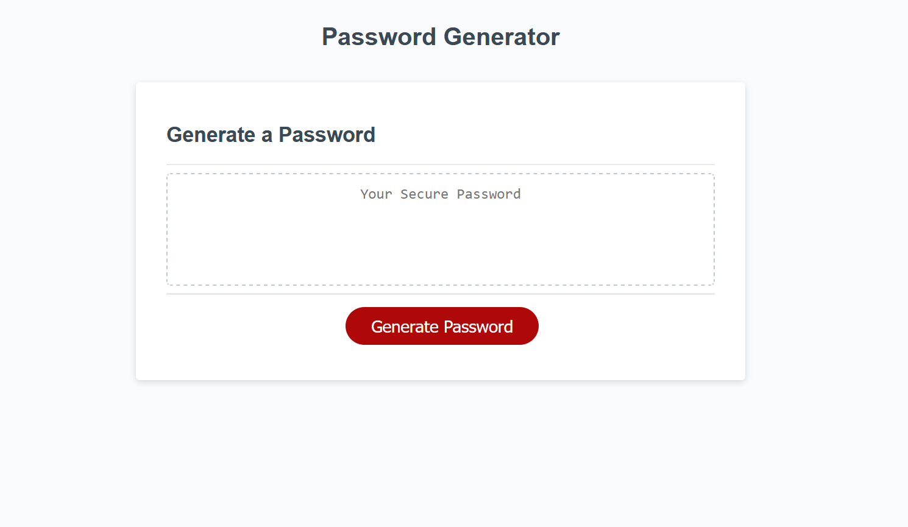

# JavaScript Password Generator

The purpose of this project was to allow the user to produce a randomly-generated password, given parameters entered by the user beforehand. This was done by utilizing resources like W3Schools and Mozilla to properly compile a series of variables and functions within javascript to produce this outcome.

Screenshot of webpage:

---

Follow link https://brutchley9.github.io/module-3-challenge/ to access this website!

Follow link https://github.com/brutchley9/module-3-challenge to access GitHub repository for this website (including code).

---

# Resources

<li>https://developer.mozilla.org/en-US/docs/Web/API/Element/querySelector</li>

<li>https://www.w3schools.com/jsref/met_win_prompt.asp</li>

<li>https://www.w3schools.com/js/js_random.asp</li>

<li>https://developer.mozilla.org/en-US/docs/Web/JavaScript/Reference/Global_Objects/Math/random</li>

<li>https://developer.mozilla.org/en-US/docs/Web/JavaScript/Reference/Statements/let</li>

<li>https://www.w3schools.com/jsref/jsref_return.asp</li>

<li>https://www.w3schools.com/jsref/met_win_confirm.asp</li>

<li>https://developer.mozilla.org/en-US/docs/Web/JavaScript/Reference/Global_Objects/Array/join</li>

<li>https://developer.mozilla.org/en-US/docs/Web/JavaScript/Reference/Global_Objects/Array/concat</li>

<li>https://stackoverflow.com/questions/2450954/how-to-randomize-shuffle-a-javascript-array</li>